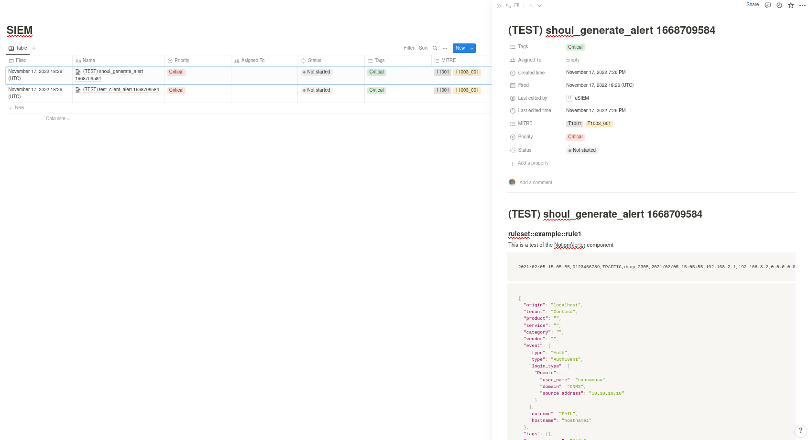

# usiem-notioner
Send Alerts to Notion and use it as a ticketing tool.

This components needs to have certain variables in his Secret Dataset:
* DATABASE_ID: The notion Database
* API_KEY: The notion API key